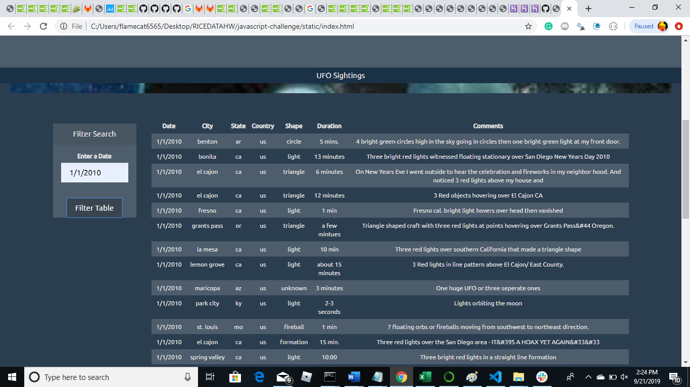
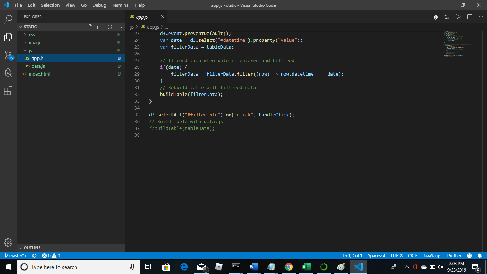

# UFO Sightings Project

In this project I am building a website using Javascript and HTML to display information on UFO sightings. Javascript is use as the main script to run the analysis.
First I provide code to create an Automatic Table using code to append data to a table and Date Search filter.
Four files are created:
  1. A basic HTML web page (see file index.html provided)
    a. HTML code and javascript lists events (UFO sightings) and search through date/time column to find rows that match user input. 
  2. A UFO dataset which is provided (data.js) in the form of an array of JavaScript objects
  3. An app.js javascript file is used to create the tables and for filtering the data. Columns for tabe include:
    a. date/time, city, state, country, shape, and comment at the very least.
# Table Produced with Applied Search Date Field

# Alternate Page: No Table Produced until Applied Search Date Field is Populated
(![table]images/ufo_notable_page.png)

An alternate coding for a blank page with no table produced until the date search field is populated can be done by commenting the "buildTable(tableData);" code out (see below app.js line 37 of code).

